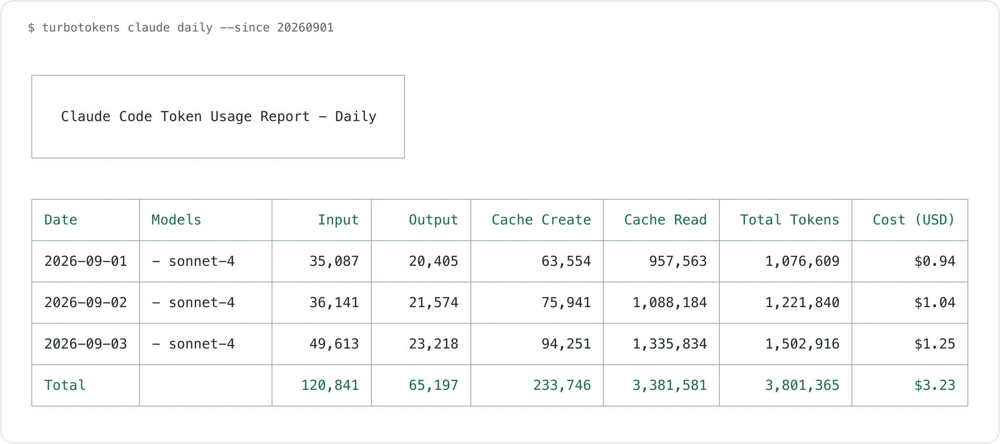
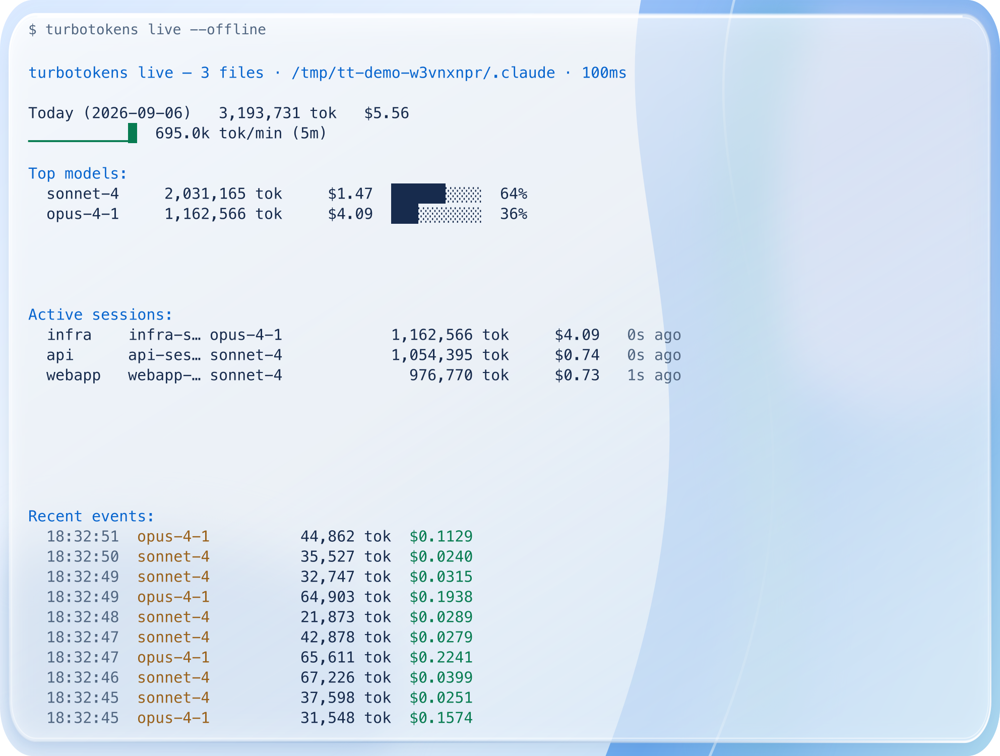
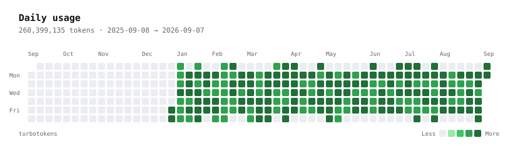
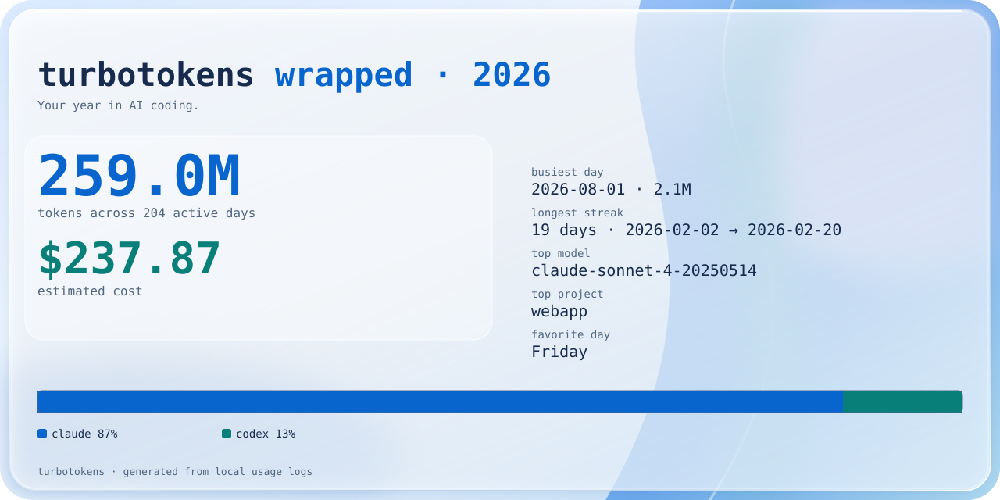
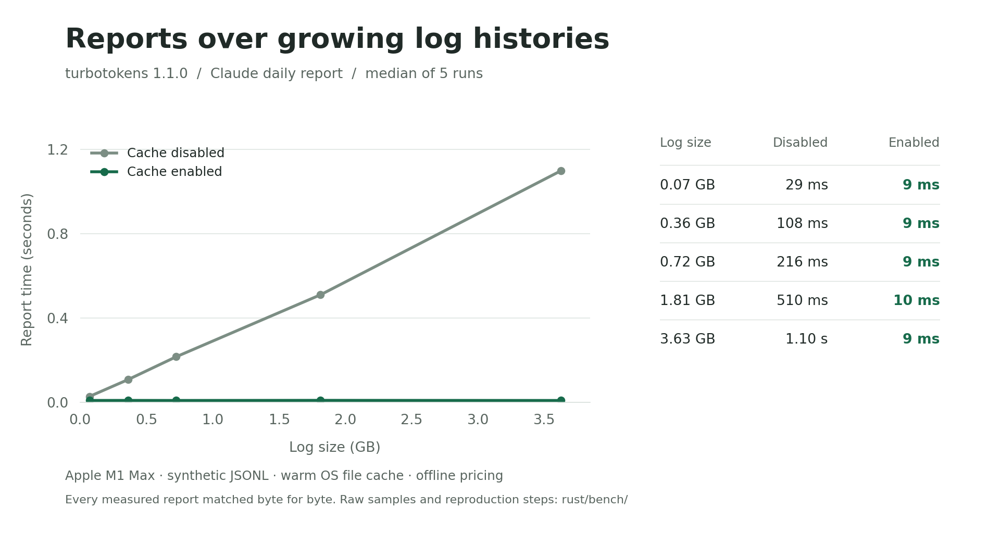

# turbotokens

Token usage and estimated costs for your AI coding agents, from the terminal.

Read local usage history across 18 agents, filter it by date or session, and export JSON for your own reports. A live dashboard follows Claude Code or Codex as they write new usage. The CLI is a native Rust binary.

[Install](#install) · [Commands](#commands) · [Performance](#performance) · [Releases](https://github.com/maxmoneycash/turbotokens/releases)

## Install

With Homebrew on macOS or Linux:

```sh
brew install maxmoneycash/tap/turbotokens
```

With npm:

```sh
npx turbotokens
```

Or [download a binary](https://github.com/maxmoneycash/turbotokens/releases/latest) for macOS, Linux, or Windows. Each platform has x64 and arm64 builds. The npm package downloads the same binary and requires Node.js and installation scripts enabled.

A shell installer is also available for macOS and Linux:

```sh
curl -fsSL https://raw.githubusercontent.com/maxmoneycash/turbotokens/main/install.sh | sh
```

## Commands

Start with a daily report across the agents detected on your machine:

```sh
turbotokens
```



```sh
turbotokens codex daily                      # One agent
turbotokens monthly --since 20260101         # This year's monthly totals
turbotokens daily --json                     # Structured output
turbotokens session                         # Usage grouped by session
turbotokens doctor                          # Data discovery and pricing checks
```

Costs come from recorded usage and model pricing. They are estimates, and may differ from your bill. Subscription allowances are separate; `turbotokens limits` queries available Claude and Codex plan limits using your existing sign-in credentials.

### Follow a session

```sh
turbotokens live
turbotokens live --agent codex
```



The dashboard includes a JSON event stream, budget webhooks, and a Prometheus endpoint. See [live mode and integrations](docs/usage.md#live-mode).

### Export your usage

```sh
turbotokens heatmap --svg heatmap.svg
turbotokens wrapped --year 2026 --svg wrapped.svg
```

<details>
<summary>Preview the heatmap and yearly summary</summary>





Illustrative data. These README previews use a light presentation theme; CLI exports use a dark theme.

</details>

Other commands include `weekly`, `blocks`, `import`, `daemon`, and `completions`. See the [usage guide](docs/usage.md), or run `turbotokens <command> --help` for the flags supported by that command.

### Supported agents

Claude Code, Codex, OpenCode, Amp, Gemini, Copilot, Kimi, Grok Build, Qwen, Droid, Codebuff, Hermes, Goose, Kilo, OpenClaw, pi-agent, Antigravity, and ZCode.

Report detail depends on the data each agent records. The [adapter notes](rust/adapters/README.md) describe source formats and agent-specific behavior. Live mode supports Claude Code and Codex.

## Performance

The Claude adapter caches parsed usage for repeated reports. This benchmark measures the released binary on synthetic logs with the cache enabled and disabled, checking that every run produces byte-identical JSON.



[Measurements and methodology](rust/bench/README.md) include the hardware, raw samples, dataset generator, and reproduction command. The horizontal axis measures bytes of logs read. Token totals are usage counters in those logs, not text that turbotokens tokenizes.

## Data and pricing

Reports read agent data on your machine. Pricing lookups may contact external services; use `--offline` where supported to use embedded or cached rates. `limits` contacts the corresponding provider, and a configured webhook sends alert data to the URL you choose. These features do not upload your log files.

## Development

Use a Rust toolchain that supports edition 2024:

```sh
cd rust
cargo build --release --bin turbotokens --features fetch-litellm-pricing
cargo test --workspace --features fetch-litellm-pricing
cargo clippy --release --bin turbotokens --features fetch-litellm-pricing
```

The build embeds a pricing snapshot. For a local snapshot, set `TURBOTOKENS_PRICING_JSON_PATH` to a LiteLLM `model_prices_and_context_window.json` file. See [packaging](packaging/README.md) for release checks and [demo assets](demo/README.md) for image generation.

## License

[MIT](LICENSE). turbotokens began as a fork of [ccusage](https://github.com/ccusage/ccusage) by [@ryoppippi](https://github.com/ryoppippi). The original copyright is preserved alongside the rewrite's attribution.
